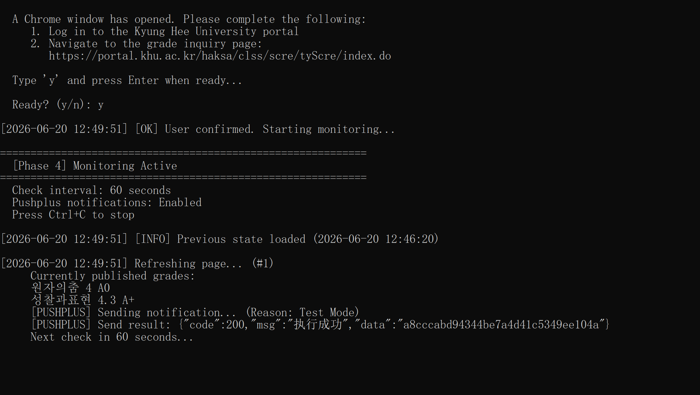
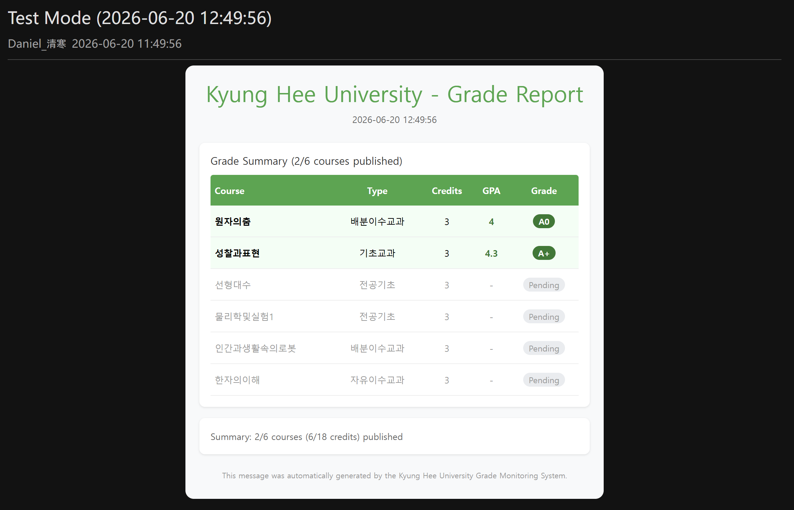

# Kyung Hee University Grade Monitor

A Python-based daemon-grade monitoring system that automatically tracks grade postings on the Kyung Hee University (KHU) portal. It periodically refreshes the grade inquiry page, detects changes, and sends real-time notifications via **Pushplus**.

---

## Features

- **Automated Grade Monitoring** — Refreshes the grade page every 60 seconds to prevent session timeouts and capture grade updates as soon as they are posted.
- **Change Detection** — Compares current grade data against the previous state and identifies newly published grades, updated scores, or status changes (e.g., "Pending" → "Finalized").
- **Pushplus Notifications** — Sends richly formatted HTML email/push notifications when grades change, including a full grade table with color-coded GPA and letter grades.
- **Hourly Summary Reports** — Automatically sends a status report at the top of every hour, so you never miss an update.
- **Daemon Mode** — Runs as a background watchdog process with automatic crash recovery (up to 100 restarts). Manage it with simple command-line flags.
- **Chrome Remote Debugging** — Launches and controls Chrome via Selenium's remote debugging protocol for reliable web scraping.

---

## Demo

### Console Monitoring



*Terminal output showing the grade monitoring loop, refresh cycles, and detected grade changes.*

### Pushplus Notification



*Rich HTML push notification delivered to mobile, displaying the full grade table with color-coded GPA and letter grades.*

### Video Demonstration


*Full walkthrough: launching the monitor, login process, and receiving a Pushplus notification in real time.*

---

## Prerequisites

- **Python 3.8+** with the following packages installed:
  - `selenium`
  - `webdriver-manager` (optional, for automatic ChromeDriver management)
  - `requests`
- **Google Chrome** browser
- A **Pushplus** account and API token (configured in the script)

Install dependencies:

```bash
pip install selenium webdriver-manager requests
```

---

## Usage

### Interactive Mode

Run the script directly in the terminal:

```bash
python main.py
```

The program will:
1. Launch Chrome in remote debugging mode.
2. Prompt you to log in to the KHU portal and navigate to the grade inquiry page.
3. Begin monitoring and display published grades every 60 seconds.

### Daemon Mode (Background)

Start the daemon:

```bash
python main.py --daemon
```

The watchdog process will automatically restart the monitoring routine if it crashes.

### Manage the Daemon

```bash
# Check daemon status
python main.py --daemon-status

# View recent daemon logs
python main.py --daemon-logs

# Stop the daemon
python main.py --daemon-stop
```

### Windows Batch Files (Convenience)

For quick access on Windows, double-click the provided `.bat` files:

| File | Action |
|------|--------|
| `daemon-run.bat` | Start the daemon |
| `daemon-stop.bat` | Stop the daemon |
| `daemon-status.bat` | Check daemon status |
| `daemon-logs.bat` | View daemon logs |

---

## Configuration

Key settings at the top of `main.py`:

| Variable | Description |
|----------|-------------|
| `CHECK_INTERVAL` | Seconds between refresh cycles (default: `60`) |
| `PUSHPLUS_TOKEN` | Your Pushplus API token |
| `TEST_MODE` | When `True`, sends a test notification on the first cycle |
| `CHROME_DEBUG_PORT` | Remote debugging port (default: `9222`) |

---

## Project Structure

```
GetScore/
├── main.py                 # Main monitoring script
├── config.json             # User configuration (Pushplus token, etc.)
├── grade_state.json        # Cached grade data (ignored by git)
├── grade_daemon.log        # Daemon log output (ignored by git)
├── grade_daemon.pid        # Daemon PID file (ignored by git)
├── daemon-run.bat          # Windows batch file to start daemon
├── daemon-stop.bat         # Windows batch file to stop daemon
├── daemon-status.bat       # Windows batch file to check status
├── daemon-logs.bat         # Windows batch file to view logs
├── assets/                 # Demo media assets
│   ├── console-screenshot.png
│   ├── pushplus-screenshot.png
│   └── demo.mp4
├── .gitignore
└── README.md
```

---

## License

This project is for personal educational use. Modify and adapt it as needed for your own grade monitoring purposes.
